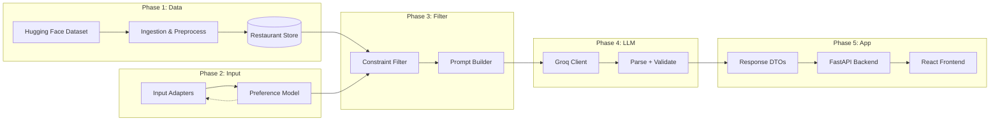
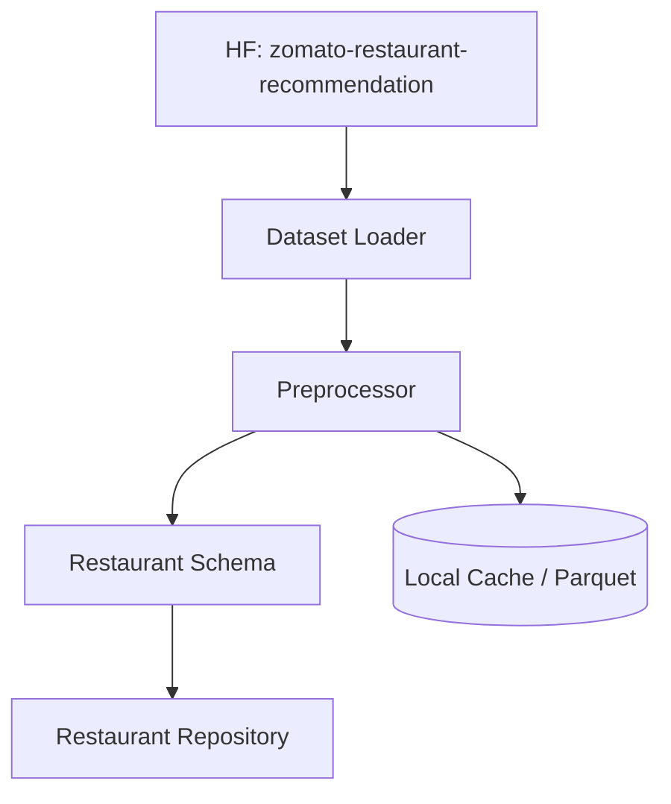
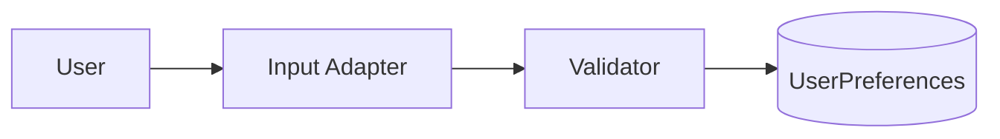
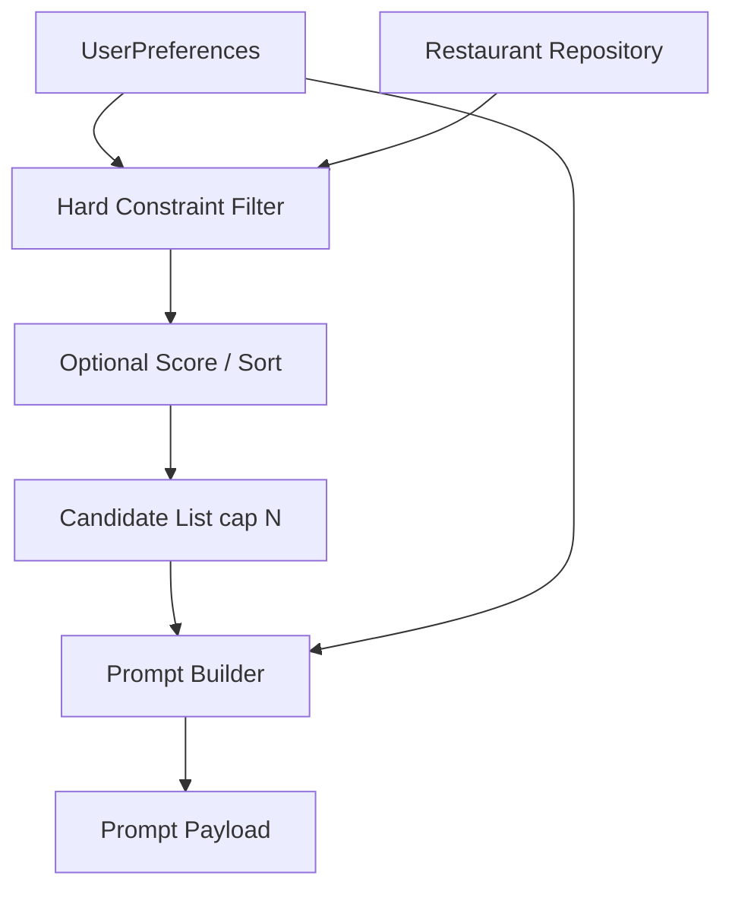
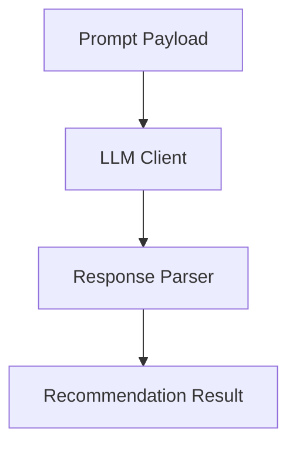
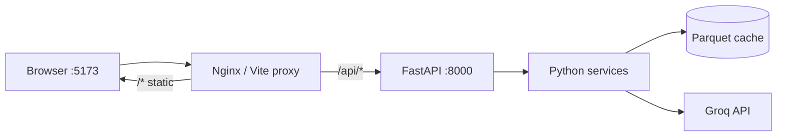
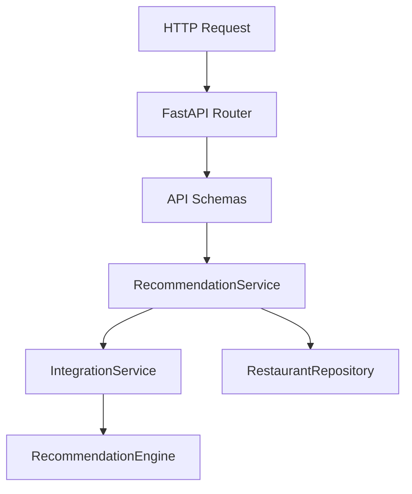
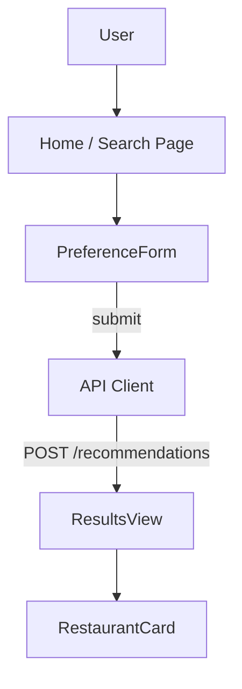
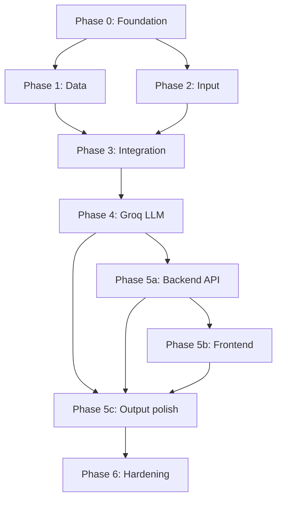

# Phase-Wise Architecture: AI-Powered Restaurant Recommendation System

This document breaks the [problem statement](./problemstatement.md) into implementation phases. Each phase has a clear scope, components, and exit criteria before moving to the next.

**Current status:** Phases **0–4** are implemented in Python (CLI + core pipeline). Phase **5** adds a **FastAPI backend** and **web frontend**. Phase **6** covers production hardening and deployment of both tiers.

---

## System Architecture (Target — After Phase 5)

```mermaid
flowchart TB
    subgraph Client["Frontend (Phase 5b)"]
        WEB[React Web App]
        FORM[Preference Form]
        CARDS[Recommendation Cards]
        WEB --> FORM
        WEB --> CARDS
    end

    subgraph API["Backend API (Phase 5a)"]
        FAST[FastAPI]
        ROUTES[REST Routes]
        DTO[Request/Response Schemas]
        FAST --> ROUTES --> DTO
    end

    subgraph Core["Python Core (Phases 0–4)"]
        INPUT[Input + Validation]
        INT[Integration Service]
        GROQ[Groq LLM Client]
        REPO[(Restaurant Repository)]
        INPUT --> INT --> GROQ
        REPO --> INT
    end

    FORM -->|HTTPS JSON| ROUTES
    ROUTES --> INPUT
    GROQ --> DTO
    DTO -->|JSON| CARDS

    subgraph Data["Data (Phase 1)"]
        HF[Hugging Face Dataset]
        CACHE[(Parquet Cache)]
        HF --> CACHE --> REPO
    end
```



**Design principle:** Structured data handles *hard* constraints (location, budget band, min rating, cuisine). **Groq** handles soft preferences, ranking, tie-breaking, and natural-language explanations—only on a filtered candidate set. The **frontend never calls Groq directly**; all LLM and dataset access goes through the backend.

---

## High-Level View (Pipeline Phases)



---

## Phase Overview

| Phase | Name | Status | Primary outcome |
|-------|------|--------|-----------------|
| 0 | Foundation | Done | Repo layout, config, dependencies, CLI entry |
| 1 | Data ingestion | Done | HF dataset → Parquet cache → `RestaurantRepository` |
| 2 | User input | Done | `UserPreferences` + validators + CLI/JSON adapters |
| 3 | Integration layer | Done | Filter → cap → prompt payload |
| 4 | Recommendation engine | Done | Groq ranking + parse + fallback |
| 5 | **Web application** | Planned | **FastAPI backend** + **React frontend** + API contract |
| 5a | Backend API | Planned | REST endpoints wrapping core services |
| 5b | Frontend | Planned | Preference form + recommendation results UI |
| 5c | Output contract | Planned | Stable JSON for UI; dedupe display names |
| 6 | Hardening | Optional | Tests, Docker, CI, observability, rate limits |

---

## Phase 0: Foundation

**Goal:** Establish project skeleton so later phases plug in cleanly.

### Components

| Component | Responsibility |
|-----------|----------------|
| **Project structure** | Modules for `data`, `models`, `filter`, `llm`, `api`/`cli`, `ui` |
| **Configuration** | API keys (LLM), dataset path/cache, budget band mappings, top-N limits |
| **Environment** | `.env` for secrets; example env template |
| **Entry point** | Single command or script to run the app |

### Suggested layout (current + Phase 5 target)

```
zomato-recommender/
├── config/                 # pydantic-settings
├── data/                   # loader, cache, repository, matching
├── models/                 # Restaurant, UserPreferences, RecommendationResult
├── input/                  # validators, serializers, adapters
├── services/               # filter, integration, prompt, groq, recommendation_engine
├── presentation/           # CLI formatters (dev)
├── api/                    # Phase 5a — FastAPI app, routes, API schemas
├── frontend/               # Phase 5b — React SPA
├── main.py                 # CLI (retained for scripts / debugging)
├── requirements.txt
├── .env.example
└── docker-compose.yml      # Phase 6 — backend + frontend
```

### Exit criteria

- [ ] Dependencies install and app boots without business logic
- [ ] Config loads from environment with sensible defaults
- [ ] README documents how to run locally

---

## Phase 1: Data Ingestion

**Goal:** Load the Hugging Face dataset, normalize it, and expose restaurants for filtering and prompts.

*Maps to problem statement: **Data ingestion***

### Components



| Component | Responsibility |
|-----------|----------------|
| **Dataset loader** | `datasets` / Hugging Face API; download on first run |
| **Preprocessor** | Parse location, cuisine lists, cost into numeric bands, normalize ratings |
| **Restaurant schema** | Typed record: `name`, `location`, `cuisines`, `cost`, `rating`, extras |
| **Repository** | In-memory list, pandas DataFrame, or SQLite for queries |
| **Cache** | Avoid re-downloading on every startup |

### Data decisions

- **Budget bands:** Map raw cost (e.g. `₹500`, `1,000–2,000`) → `low` / `medium` / `high` with configurable thresholds.
- **Location:** Normalize city names (case, aliases) for exact or fuzzy match.
- **Cuisine:** Split multi-value strings; support “any of” matching.

### Interfaces (outputs of this phase)

```
RestaurantRepository
  ├── load() -> void
  ├── all() -> List[Restaurant]
  └── find_by_filters(...) -> List[Restaurant]   # used heavily in Phase 3
```

### Exit criteria

- [ ] Dataset loads from [Hugging Face](https://huggingface.co/datasets/ManikaSaini/zomato-restaurant-recommendation)
- [ ] Required display fields are populated and documented
- [ ] Sample query returns restaurants for a known city/cuisine

---

## Phase 2: User Input

**Goal:** Capture and validate user preferences at runtime.

*Maps to problem statement: **User input***

### Components



| Component | Responsibility |
|-----------|----------------|
| **Input adapter** | CLI prompts, web form, or REST `POST /recommend` body |
| **UserPreferences model** | `location`, `budget`, `cuisines[]`, `min_rating`, `extras` (free text) |
| **Validator** | Required fields, enum checks, rating range; defaults for optional fields |
| **Serializer** | Convert preferences to a stable object for filter + prompt layers |

### Preference model (example)

```python
UserPreferences:
  location: str              # required
  budget: Literal["low","medium","high"]
  cuisines: list[str]        # optional; empty = any
  min_rating: float          # default e.g. 3.0
  additional: str | None     # "family-friendly", "quick service"
```

### Exit criteria

- [ ] All problem-statement inputs are captured
- [ ] Invalid input returns clear errors (not silent failures)
- [ ] Preferences object is passed unchanged to Phase 3

---

## Phase 3: Integration Layer

**Goal:** Narrow the full dataset to a relevant candidate set and build an LLM-ready prompt.

*Maps to problem statement: **Integration layer***

### Components



| Component | Responsibility |
|-----------|----------------|
| **Hard constraint filter** | Location match, budget band, `rating >= min_rating`, cuisine overlap |
| **Candidate cap** | Limit to top 20–50 rows (by rating/popularity) to control token cost |
| **Prompt builder** | System + user messages; embed JSON/table of candidates + user prefs |
| **Grounding rules** | Instruct LLM to only recommend from provided list (reduce hallucination) |

### Filter pipeline (order matters)

1. Location (city/area)
2. Minimum rating
3. Budget band
4. Cuisine (if specified)
5. Cap result count for LLM context

### Prompt structure (conceptual)

| Section | Content |
|---------|---------|
| **System** | Role, rules: use only listed restaurants, output format |
| **User context** | Serialized preferences + `additional` free text |
| **Candidates** | Compact table: name, cuisine, rating, cost, location, notes |
| **Task** | Rank top K, explain each, optional summary paragraph |

### Exit criteria

- [ ] Filter returns a small, relevant set (not entire dataset)
- [ ] Empty filter result handled with user-facing message (skip LLM or suggest relaxing constraints)
- [ ] Prompt payload is logged/reviewable in dev mode

---

## Phase 4: Recommendation Engine (LLM)

**Goal:** Rank candidates and generate explanations grounded in structured data.

*Maps to problem statement: **Recommendation engine***

### Components



| Component | Responsibility |
|-----------|----------------|
| **LLM client (Groq)** | `GroqLLMClient`; JSON mode; retries, timeout, rate limits |
| **Structured output** | JSON schema or function calling: `rank`, `name`, `explanation`, `summary` |
| **Response parser** | Validate names exist in candidate list; map back to full `Restaurant` rows |
| **Fallback** | If LLM fails: return filter-sorted top-N with template explanations |

### LLM responsibilities (explicit split)

| Task | Owner |
|------|--------|
| Location / budget / rating / cuisine gates | Phase 3 filter |
| Soft prefs (“family-friendly”, “quick service”) | LLM |
| Ranking among valid candidates | LLM |
| Per-restaurant explanation | LLM |
| Optional summary of top picks | LLM |

### Exit criteria

- [x] Returns ordered top-N recommendations
- [x] Each item includes an explanation tied to user prefs
- [x] No recommendations for restaurants outside the candidate list
- [x] Optional summary paragraph when requested
- [x] Groq provider with template fallback on failure

---

## Phase 5: Web Application (Backend + Frontend)

**Goal:** Deliver a proper **backend API** and **web frontend** on top of the existing Python core. Users interact via browser; the CLI remains for development.

*Maps to problem statement: **Output** + full product experience*

### Phase 5 breakdown

| Sub-phase | Layer | Technology |
|-----------|-------|------------|
| **5a** | Backend API | FastAPI, Uvicorn, Pydantic API schemas |
| **5b** | Frontend | React 18 + Vite, TypeScript, fetch/axios |
| **5c** | Output contract | Shared JSON DTOs; dedupe by name for display |

### Target deployment topology



---

### Phase 5a: Backend API

**Goal:** Thin HTTP layer that owns secrets, validation, and orchestration. No business logic duplication—delegate to `IntegrationService` and `RecommendationEngine`.

#### Components



| Component | Responsibility |
|-----------|----------------|
| **`api/main.py`** | FastAPI app factory, CORS, lifespan (load dataset on startup) |
| **`api/routes/health.py`** | `GET /health`, `GET /ready` (data loaded?) |
| **`api/routes/recommendations.py`** | `POST /api/v1/recommendations` |
| **`api/routes/meta.py`** | `GET /api/v1/meta` — budget bands, defaults, example locations |
| **`api/schemas/`** | Request/response Pydantic models (mirror `UserPreferences`, `RecommendationResult`) |
| **`api/deps.py`** | Shared `RestaurantRepository`, settings, singleton services |
| **`api/errors.py`** | Map domain errors → HTTP 400/422/503 with stable `error` JSON |

#### API contract

**`POST /api/v1/recommendations`**

Request:

```json
{
  "location": "Bellandur",
  "budget": "high",
  "cuisines": ["Italian"],
  "min_rating": 4.0,
  "additional": "family-friendly",
  "top_k": 5
}
```

| Field | Type | Required | Notes |
|-------|------|----------|-------|
| `location` | string | yes | City or area |
| `budget` | `low` \| `medium` \| `high` | no | default `medium`; optional future: `max_cost_inr` |
| `cuisines` | string[] | no | empty = any |
| `min_rating` | number | no | default `3.0`, range 0–5 |
| `additional` | string | no | soft prefs for Groq |
| `top_k` | integer | no | default `5`, max `10` |

Response `200`:

```json
{
  "summary": "Top picks in Bellandur for high budget...",
  "used_fallback": false,
  "filter_stats": {
    "initial": 51717,
    "after_location": 1336,
    "after_rating": 188,
    "after_budget": 32,
    "after_cuisine": 32,
    "capped_for_llm": 30
  },
  "recommendations": [
    {
      "rank": 1,
      "id": "09b589f3f141e9e4",
      "name": "Chili's American Grill & Bar",
      "cuisine": "American, Tex-Mex, Burger, BBQ",
      "rating": 4.6,
      "estimated_cost": "1,800",
      "location": "Bellandur, Bangalore",
      "explanation": "...",
      "is_ai_generated": true
    }
  ]
}
```

Response when no candidates (`200`, empty list + message):

```json
{
  "summary": null,
  "used_fallback": false,
  "skip_llm": true,
  "message": "No restaurants match your filters. Try lowering min_rating...",
  "recommendations": []
}
```

Error responses:

| Status | When |
|--------|------|
| `422` | Invalid preferences (field-level errors) |
| `503` | Dataset not loaded |
| `502` | Groq quota/billing failure (no fake AI text) |
| `504` | Upstream timeout after fallback exhausted |

#### Backend service flow

```python
# Conceptual — api/services/recommendation_service.py
class RecommendationService:
    def recommend(self, body: RecommendRequest) -> RecommendResponse:
        prefs = validate_preferences(body.model_dump())
        integration = IntegrationService(self.repo).run(prefs, top_k=body.top_k)
        if integration.skip_llm:
            return RecommendResponse.from_empty(integration)
        result = RecommendationEngine().recommend(integration, prefs)
        return RecommendResponse.from_domain(result, integration.filter_result)
```

#### Lifespan & performance

- **Startup:** `RestaurantRepository.load()` once; fail `/ready` until cache exists.
- **LLM calls:** Run Groq in `asyncio.to_thread()` or `run_in_executor` so FastAPI stays non-blocking.
- **Secrets:** `GROQ_API_KEY` only on server; never sent to browser.

#### Exit criteria (5a)

- [ ] `POST /api/v1/recommendations` runs full pipeline (filter → Groq → parse)
- [ ] `GET /health` and `GET /ready` implemented
- [ ] CORS allows frontend origin (localhost + production domain)
- [ ] OpenAPI docs at `/docs` for frontend integration
- [ ] CLI `main.py recommend` and API share the same core modules

---

### Phase 5b: Frontend

**Goal:** Zomato-inspired UI for preference input and readable recommendation cards—no direct access to dataset or Groq.

#### Components



| Component | Responsibility |
|-----------|----------------|
| **`frontend/src/pages/Home.tsx`** | Layout: form + results |
| **`PreferenceForm`** | Location, budget select, cuisines chips, min rating slider, additional textarea |
| **`api/client.ts`** | `recommend(preferences)` → typed fetch with error handling |
| **`ResultsView`** | Summary banner, loading/error states, empty-filter guidance |
| **`RestaurantCard`** | Rank badge, name, cuisine, rating, cost, location, explanation |
| **`hooks/useRecommend.ts`** | Loading state, abort in-flight requests |

#### UX requirements

| State | Behavior |
|-------|----------|
| **Loading** | Skeleton cards or spinner; disable submit |
| **Validation** | Inline errors before submit (mirror backend rules) |
| **Empty filter** | Show `message` from API; suggest relaxing constraints |
| **Fallback** | Badge: “Ranked by rating (AI unavailable)” when `used_fallback` |
| **Errors** | Toast or alert for 502/504; never show raw JSON |

#### Frontend ↔ backend

| Concern | Approach |
|---------|----------|
| **Dev** | Vite proxy: `/api` → `http://localhost:8000` |
| **Prod** | Same origin via Nginx, or `VITE_API_BASE_URL` |
| **Types** | Generate from OpenAPI (`openapi-typescript`) or hand-written mirrors |

#### Exit criteria (5b)

- [ ] User can submit Bellandur + budget + rating and see top 5 cards
- [ ] All problem-statement display fields visible per card
- [ ] Mobile-friendly responsive layout
- [ ] Works against local backend without CLI

---

### Phase 5c: Output & display polish

| Component | Responsibility |
|-----------|----------------|
| **Response mapper** | `RecommendationResult` → API DTO; include `filter_stats` |
| **Name deduplication** | Collapse duplicate outlet rows by `name` + `location` in API response (keep highest rank) |
| **Budget UX** | Document band mapping in UI (`low` ≤ ₹500, `medium` ≤ ₹1500, `high` > ₹1500); optional helper for “~₹2000” → `high` |
| **CLI formatter** | Keep `presentation/formatter.py` aligned with API shape |

#### Required fields per recommendation (unchanged)

- Restaurant name  
- Cuisine  
- Rating  
- Estimated cost  
- AI-generated explanation (or template when `used_fallback`)

#### Exit criteria (5c)

- [ ] End-to-end: browser form → API → Groq → cards
- [ ] Output readable without logs or raw LLM JSON
- [ ] Matches [success criteria](./problemstatement.md#success-criteria)

---

## Phase 6: Hardening & Production

**Goal:** Production-ready backend + frontend without changing core pipeline boundaries.

| Area | Backend | Frontend | Shared |
|------|---------|----------|--------|
| **Testing** | pytest + `TestClient`; mock Groq | Vitest + React Testing Library | Contract tests on OpenAPI |
| **Observability** | Structured logs, request ID, latency metrics | Error boundary, optional analytics | Filter counts, Groq latency |
| **Security** | Rate limit per IP; no keys in responses | CSP headers; sanitize display | Never log `GROQ_API_KEY` |
| **Performance** | Dataset warm on startup; executor for Groq | Code split, lazy routes | Parquet cache |
| **Deployment** | Docker image `backend` | Docker image `frontend` or static CDN | `docker-compose up` |

### Docker Compose (target)

```yaml
# Conceptual
services:
  backend:
    build: .
    env_file: .env
    ports: ["8000:8000"]
    volumes: ["./.cache:/app/.cache"]
  frontend:
    build: ./frontend
    ports: ["5173:80"]
    depends_on: [backend]
```

### Exit criteria (Phase 6)

- [ ] `docker compose up` runs full stack locally
- [ ] CI: lint + unit tests + API smoke test (mock Groq)
- [ ] Health checks for orchestration (K8s / Railway / Render)

---

## End-to-End Request Flow (Web — After Phase 5)

Sequence for a single recommendation request from the browser:

```mermaid
sequenceDiagram
    actor U as User
    participant FE as React Frontend
    participant API as FastAPI Backend
    participant VAL as Validator
    participant R as Restaurant Repo
    participant INT as IntegrationService
    participant G as Groq LLM
    participant PAR as ResponseParser

    U->>FE: Fill form (location, budget, rating, ...)
    FE->>API: POST /api/v1/recommendations
    API->>VAL: validate_preferences()
    API->>R: all() + filter pipeline
    INT->>INT: cap candidates, build prompt
    INT->>G: chat.completions (JSON mode)
    G-->>PAR: raw JSON
    PAR->>PAR: match ids, drop hallucinations
    API->>API: map to RecommendResponse DTO
    API-->>FE: 200 JSON
    FE-->>U: Summary + recommendation cards
```

**CLI path (implemented):** Same core flow via `main.py recommend` — skips FastAPI, uses `presentation/formatter.py` for terminal output.

---

## Cross-Cutting Concerns

| Concern | Where it lives |
|---------|----------------|
| **Configuration** | `config/settings.py`; `.env` on backend only |
| **Domain models** | `models/` — shared by API, services, CLI |
| **API contracts** | `api/schemas/` — Phase 5a; must stay in sync with frontend types |
| **Errors** | Empty filter → 200 + message; Groq quota → 502; validation → 422 |
| **Token budget** | Candidate cap in Phase 3; truncate long fields in prompt |
| **Hallucination control** | Grounding prompt + `ResponseParser` (Phase 4) |
| **CORS** | FastAPI middleware — Phase 5a |
| **Auth** | Out of scope for MVP; add API key or OAuth in Phase 6 if public |

---

## Phase Dependencies



**Minimum viable product (web):** Phases 0–4 (done) → **5a** (API) → **5b** (UI) → **5c** (dedupe + polish) → **6** (deploy).

Phases **5a** and **5b** can be developed in parallel once the API contract (OpenAPI) is agreed.

---

## Implementation Order (Suggested)

| Sprint | Focus | Deliverable |
|--------|-------|-------------|
| 1 | Phases 0 + 1 | Data loads; cache; filter script |
| 2 | Phases 2 + 3 | Preferences + filter + prompt preview |
| 3 | Phase 4 | Groq recommendations; CLI `recommend` |
| **4** | **Phase 5a** | FastAPI + `POST /recommendations` + `/docs` |
| **5** | **Phase 5b** | React form + results cards against local API |
| **6** | **Phase 5c** | Dedupe, filter stats in UI, budget helper copy |
| 7 | Phase 6 | Docker Compose, tests, CI, deploy |

---

## Technology Stack (Chosen)

| Layer | Choice | Notes |
|-------|--------|-------|
| **Core** | Python 3.9+ | Existing pipeline |
| **Data** | `datasets`, pandas, Parquet cache | Phase 1 |
| **LLM** | **Groq** (`llama-3.3-70b-versatile`) | Phase 4; JSON mode |
| **Backend** | **FastAPI** + Uvicorn | Phase 5a |
| **Frontend** | **React** + **Vite** + TypeScript | Phase 5b |
| **CLI** | `rich` + `main.py` | Dev / debugging (retained) |
| **Config** | `pydantic-settings`, `python-dotenv` | Backend + CLI |
| **Deploy** | Docker Compose | Phase 6 |

Keep boundaries between **core** (`services/`), **API** (`api/`), and **frontend** (`frontend/`) so the pipeline is not rewritten when adding new clients (mobile, Slack bot, etc.).
